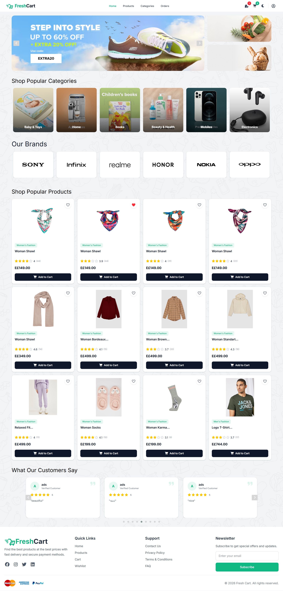
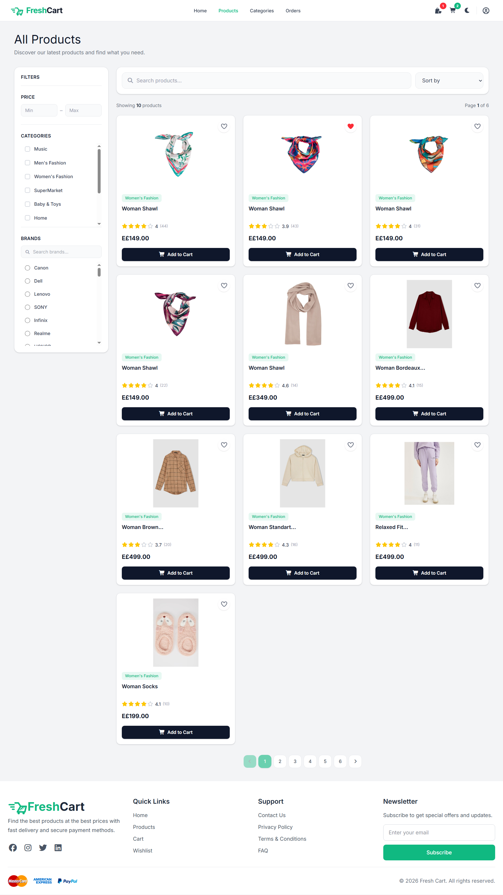
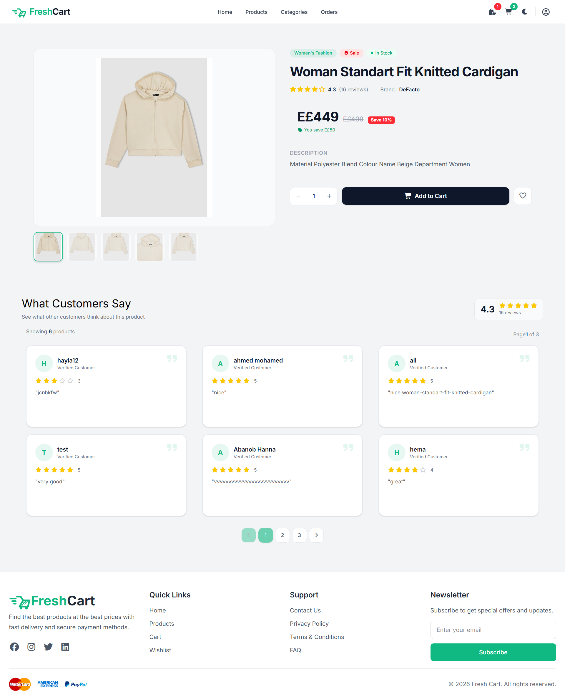
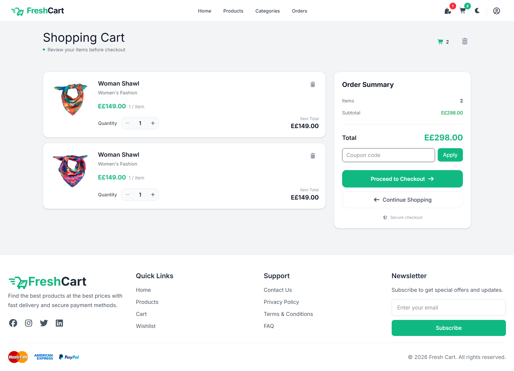
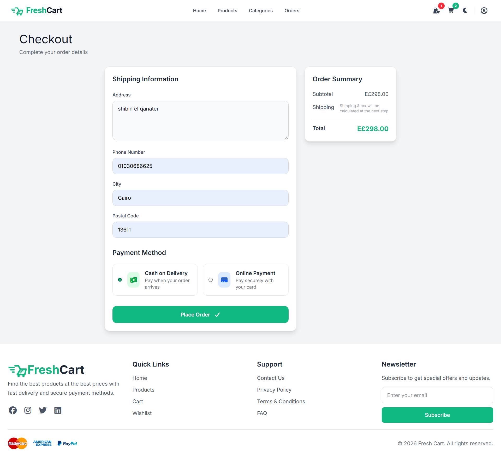
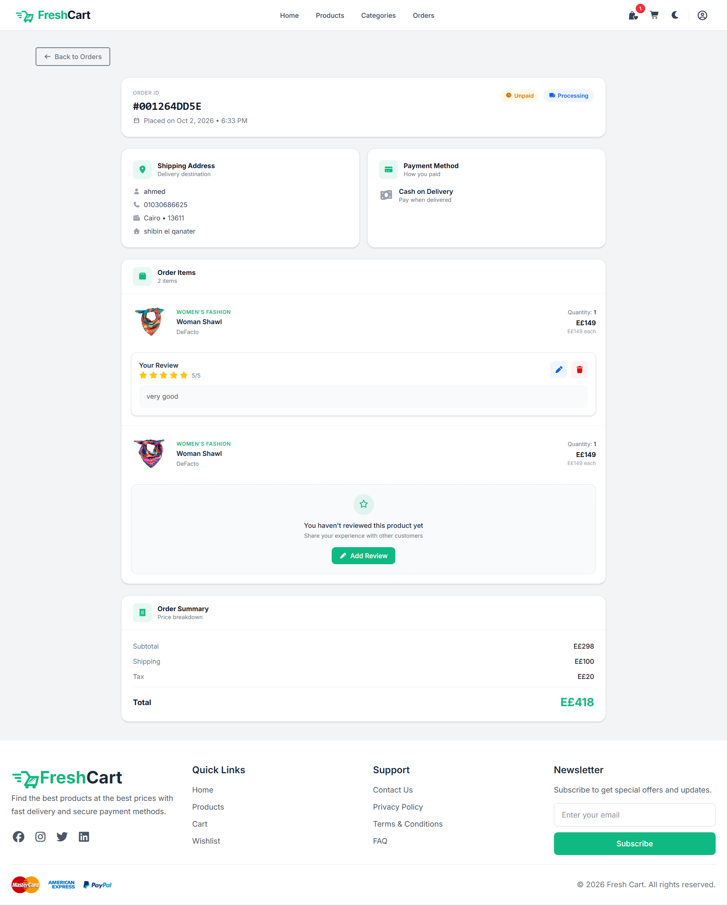

# 🛒 Fresh Cart

A modern E-commerce application built with **Angular 21**, **SSR**, and **Route API**.

Fresh Cart focuses not only on connecting UI pages to an API, but also on building a smooth user experience, handling real-world UI states, and applying modern Angular concepts.

## 🔗 Links

* **Live Demo:** https://lnkd.in/e4Uq6jYe
* **GitHub:** https://github.com/ahmedhikal2002/Fresh-Cart

---

## ✨ Features

### 🛍️ Shopping Experience

* Browse products and categories
* Product search and filtering
* Product details with reviewing
* Add products to cart
* Update product quantities
* Optimistic UI updates for cart actions
* Complete shopping flow:
  `Product Details → Cart → Checkout → Orders → Order Details`

### 💳 Checkout & Orders

* Checkout with saved addresses
* Latest added address is automatically selected as the default address
* Ability to enter a new address during checkout
* View previous orders
* View detailed order information

### ⭐ Reviews

* Add reviews
* Edit reviews
* Delete reviews

### 👤 Profile & Addresses

* Update user information
* Change password
* Manage saved addresses

### 🎨 UI & UX

* Dark / Light mode
* Loading skeletons
* Responsive design
* Form validation
* Prevents whitespace-only input
* Toast notifications
* Error handling with rollback for optimistic updates

---
## 📸 Screenshots

| Home | Products |
|------|----------|
|  |  |

| Product Details | Cart |
|-----------------|------|
|  |  |

| Checkout | Orders |
|-----------------|------|
|  |  |

### 📋 Order Details


## 🧠 Technical Highlights

### ⚡ Optimistic UI Updates

Cart actions update the UI immediately without waiting for the API response.

If the request fails, the previous state is restored through a rollback mechanism.

### 🔄 Angular Signals

Used **Angular Signals** for reactive state management.

I also used `computed()` to solve a cart state synchronization issue that appeared during development.

### 🔗 RxJS

Used RxJS operators for handling asynchronous operations and API workflows.

* `expand` for retrieving all paginated Brand API results
* `reduce` for combining the retrieved results
* `switchMap` for connecting product quantity selection with the add-to-cart flow
* `catchError` and `throwError` for error handling

---

## 🛠️ Tech Stack

* Angular 21
* TypeScript
* RxJS
* Angular Signals
* Tailwind CSS
* Angular SSR
* Route API
* Font Awesome
* SweetAlert2
* ngx-toastr
* Owl Carousel

---

## 🚀 Getting Started

### Prerequisites

Make sure you have **Node.js** and **npm** installed.

### Installation

Clone the repository:

```bash
git clone https://github.com/ahmedhikal2002/Fresh-Cart.git
```

Navigate to the project:

```bash
cd Fresh-Cart
```

Install dependencies:

```bash
npm install
```

### Development Server

Run the development server:

```bash
npm start
```

Then open:

```text
http://localhost:4200/
```

---

## 🏗️ Production Build

Build the application:

```bash
npm run build
```

The production build will be generated inside the `dist/` directory.

### SSR

The project is configured with Angular SSR.

To run the generated SSR application:

```bash
npm run serve:ssr:ecommerce-app
```

---

## 📚 What I Learned

This project was an opportunity to move from learning concepts theoretically to applying them in a real application.

Some of the main concepts I practiced were:

* Optimistic UI updates and rollback
* Angular Signals and `computed()`
* Advanced RxJS operators
* API pagination handling
* Reactive UI state management
* Error handling
* Loading and empty states
* Form validation
* SSR with Angular
* Building a complete E-commerce flow

The biggest takeaway was that **practical development exposes problems that you don't always notice while following a course**. Each problem became an opportunity to learn a new concept and understand it through actual implementation.

---

## 👨‍💻 Author

**Ahmed Hikal**

Junior Angular / Frontend Developer

* GitHub: https://github.com/ahmedhikal2002
* LinkedIn: https://www.linkedin.com/in/ahmed-hikal-b479aa325/
